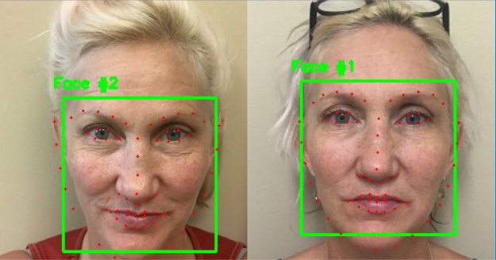

Using dlib and OpenCV to detect facial landmarks in an image. Detecting facial landmarks is a two step process:  
  
    
      

Step #1: Localize the face in the image (using HOG + Linear SVM)  
Step #2: Detect the key facial structures on the face ROI.(dilib's implementation of One Millisecond Face Alignment with an 
Ensemble of Regression Trees paper by Kazemi and Sullivan (2014).)  

dlib's pretrained facial landmark detector is used. You can download it from http://dlib.net/files/shape_predictor_68_face_landmarks.dat.bz2

python facial_landmarks.py --shape-predictor shape_predictor_68_face_landmarks.dat --image images/example_02.jpg (path to image)

